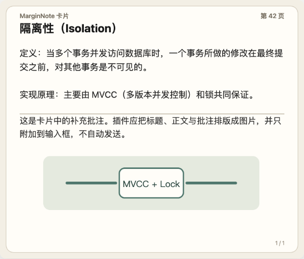

# Card → ChatGPT for MarginNote 4

Card → ChatGPT 是一款 MarginNote 4 插件。它会把当前选中的脑图卡片排版成图片，自动放入 MarginNote 内置的 ChatGPT 网页输入框，让用户可以直接针对卡片提问。

插件使用用户已登录的 ChatGPT 网页账号，不需要 OpenAI API Key。这意味着免费 对话自由



## 当前版本

`v0.1.19`

## 当前已实现的功能

### 1. 插件与 ChatGPT 窗口

- 在 MarginNote 左侧插件栏开启插件后，ChatGPT 网页窗口一定显示。
- 关闭插件后，卡片监听停止，ChatGPT 窗口一定关闭。
- 单独点击窗口右上角的 `×` 只会隐藏窗口，不会关闭整个插件；之后再选卡片时窗口会重新显示。
- 窗口中是完整的 ChatGPT 网页，可以登录、滚动、输入问题、复制回答和继续对话。
- 顶部提供临时聊天开关、刷新按钮和关闭按钮。

### 2. 卡片自动转图片

选中脑图卡片后，插件会读取并排版：

- 卡片标题；
- 文档摘录文字与摘录图片；
- 文字批注与图片批注；
- 关联卡片的标题、摘录和图片。

每张 MarginNote 卡片会生成一张 PNG，并作为附件加入 ChatGPT 输入框。

### 3. 选中数量与图片数量实时同步

- 单选一张卡片时，ChatGPT 输入框只保留这一张卡片图片。
- 从一张卡片切换到另一张时，旧图片会被新图片替换。
- 重复点击同一张卡片不会反复累积相同附件。
- 开启 MarginNote 多选后，选中三张卡片就会在输入框中保留三张对应图片。
- 取消其中一张卡片的选中状态后，对应图片也会被删除。
- 取消全部选中后，输入框中由插件添加的卡片图片会被清空。

在同步开启时，插件会尽量保持：

```text
ChatGPT 输入框中的卡片图片数量 = MarginNote 当前选中的卡片数量
```

### 4. 两种提问模式

#### 仅图片模式

- 选中卡片后只添加图片。
- 插件不会自动输入提示词，也不会自动发送。
- 用户可以根据当前卡片自行输入问题。

#### 预设提问模式

- 图片准备完成后，插件会在 ChatGPT 输入框中写入预设提示词。
- 多选卡片时只写入一次提示词。
- 提示词可以在插件内编辑并保存。
- 可选择“手动发送”或“自动发送”。
- 自动发送默认关闭；只有用户主动开启后，插件才会在图片和提示词都准备好后发送消息。
- 提示词、工作模式和自动发送设置会自动保存。

默认提示词：

```text
请根据图片中的卡片内容进行讲解。
```

### 5. 同步开关与原格式粘贴

ChatGPT 窗口右侧提供大号悬浮的 `同步：开/停` 按钮。这个按钮只控制“选卡片后是否自动传图”，不会关闭 ChatGPT 网页。

- `同步：开`：选中卡片后自动转图并加入 ChatGPT。
- `同步：停`：不转图、不写入预设提示词、不自动发送，但 ChatGPT 网页、当前对话和登录状态都继续保留。

需要把 ChatGPT 回答粘贴到 MarginNote 卡片时：

1. 在 ChatGPT 网页选中内容，按 `Command+C`，也可使用 ChatGPT 自带的复制按钮。
2. 将插件切换为 `同步：停`。
3. 在 MarginNote 中选中目标卡片。
4. 按 `Command+V`。

插件会根据当前焦点进行粘贴路由：

- 焦点在 ChatGPT 网页时，`Command+V` 粘贴到网页输入框。
- 同步停止且选中 MarginNote 卡片时，`Command+V` 粘贴到卡片评论末尾。

复制桥接会同时向系统剪贴板提供 HTML、RTF、Markdown 源文和 UTF-8 纯文本备用格式。MarginNote 会优先使用它支持的富文本格式，以保留标题、粗体、斜体、列表、代码块等结构。这也避免了中文内容粘贴到 MarginNote 或 Tot 时的乱码问题。

### 6. 临时聊天

- `临时：开`：插件尝试打开 ChatGPT 临时聊天页面。
- `临时：关`：打开普通 ChatGPT 页面。
- 切换后会立即进入对应页面，刷新按钮也会按当前偏好重新打开。
- 临时聊天是 ChatGPT 网页功能，其实际数据保留规则以 ChatGPT 当前说明为准。

### 7. ChatGPT 登录会话持久化

- 使用 MarginNote 的持久网页数据容器。
- 只备份 `chatgpt.com` 和 `openai.com` 的网页 Cookie。
- Cookie 加密保存在 macOS 钥匙串，不会明文写入插件设置、代码、README 或日志。
- 插件启动时会恢复尚未失效的 Cookie，使用过程中会定时更新备份。
- 用户主动退出登录、ChatGPT 使会话失效或触发安全验证时，仍可能需要重新登录。

### 8. 窗口移动与缩放

- 拖动顶部 `Card → ChatGPT` 标题栏可移动窗口。
- 拖动右下角弧形把手可调整窗口宽度和高度。
- 窗口会被限制在 MarginNote 可见区域内。
- 插件会保存最后的位置和尺寸，下次打开时自动恢复。

### 9. 静默操作

卡片同步、模式切换、复制和粘贴不会显示额外的 HUD 操作提示，避免遮挡学习内容。

## 安装

1. 下载仓库中的 [`dist/CardAskGPT.mnaddon`](dist/CardAskGPT.mnaddon)。
2. 双击 `.mnaddon` 文件，允许 MarginNote 4 安装或覆盖旧版。
3. 完全退出并重新打开 MarginNote 4。
4. 打开一个学习集，点击左侧插件栏中的 **Card → ChatGPT** 图标。
5. ChatGPT 窗口弹出后，首次使用请在内嵌网页中登录。

## 基本使用流程

### 手动提问

1. 开启插件。
2. 保持 `同步：开` 和 `模式：仅图片`。
3. 在 MarginNote 脑图中选中一张或多张卡片。
4. 等待对应图片出现在 ChatGPT 输入框。
5. 输入问题并发送。

### 预设提问

1. 点击 `模式：仅图片`，切换为 `模式：预设提问`。
2. 点击 `提问：手动发送/自动发送` 打开设置面板。
3. 编辑提示词，选择是否自动发送，然后保存。
4. 选中 MarginNote 卡片。
5. 插件会先同步图片，再写入提示词；若已开启自动发送，则继续发送。

## 运行要求

- MarginNote 4.0 或更高版本；
- macOS；
- 可以在 MarginNote 内嵌网页中正常访问 ChatGPT；
- ChatGPT 账号。

## 隐私说明

- 插件不调用 OpenAI API，不需要也不读取 OpenAI API Key。
- 卡片内容只会在插件将其作为图片添加到用户当前 ChatGPT 网页时上传。
- 默认的“仅图片”模式不会自动发送。
- 只有用户在“预设提问”模式中主动开启自动发送后，插件才会代为发送。
- ChatGPT/OpenAI Cookie 使用 macOS 钥匙串加密保存，不会提交到本仓库。
- 使用临时聊天前，请自行确认 ChatGPT 当前的数据处理规则。

## 已知限制

- 插件依赖 ChatGPT 网页的页面结构；ChatGPT 改版后，自动附图、自动发送、复制桥接或临时聊天识别可能需要同步更新。
- ChatGPT 可以主动使登录会话失效，插件的持久化机制无法保证永不掉线。
- HTML 卡片批注在转图时以文本内容排版，复杂样式不会完全还原。
- 极长卡片会被排版到一张高图中，显示时可能自动缩放。
- 当前只同步脑图卡片，不处理文档文本选区。
- 当前安装包是未签名开发版。

## 开发

项目不依赖 npm 包。克隆仓库后，可以直接运行：

```bash
./scripts/test.sh
./scripts/build.sh
```

- `test.sh` 会执行 JavaScript 语法检查和全部回归测试。
- `build.sh` 会生成 `dist/CardAskGPT.mnaddon`。

### 项目结构

```text
assets/icon.svg                         插件图标源文件
docs/images/                            README 示例图片
src/main.js                             插件生命周期、卡片读取与选区监听
src/panel.js                            ChatGPT 窗口、按钮、剪贴板与会话持久化
src/chatgptBridge.js                    卡片图片渲染、网页附件注入和复制桥接
src/mnaddon.json                        MarginNote 插件清单与版本号
scripts/build.sh                        安装包构建脚本
scripts/test.sh                         完整测试入口
tests/                                  网页注入、选区、界面、粘贴和会话回归测试
dist/CardAskGPT.mnaddon                 可直接安装的构建产物
```

## 参与开发

欢迎克隆、Fork 并继续开发。修改后请先运行完整测试，再重新构建 `.mnaddon` 安装包。
